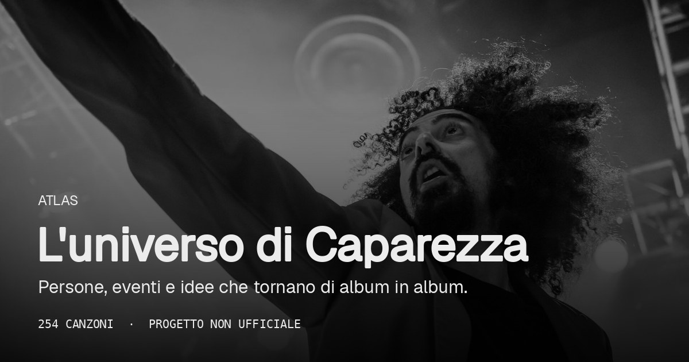

<div align="center">



# The Capa Atlas

**Il grafo 3D delle annotazioni di Caparezza.**
Ogni keyword sottolineata su Genius è un rimando, una citazione, un personaggio:
qui diventano una rete navigabile che attraversa tutti gli album.

[**→ Apri l'atlas**](https://sim186.github.io/capa-atlas/)


</div>

> Progetto fan **non ufficiale**, non affiliato a Caparezza.

## Perché

I testi di Caparezza funzionano come ipertesti. Vincent van Gogh risponde al
consumismo, la rinascita torna di disco in disco, i personaggi si richiamano da
un album all'altro. Leggere le note canzone per canzone nasconde la rete:
l'atlas la mostra intera.

L'idea nasce dall'[AI Coding Dictionary](https://aicodingdictionary.com) di
[Matt Pocock](https://github.com/mattpocock/dictionary-of-ai-coding), un
dizionario navigabile come grafo di concetti, spostato dalle parole dell'AI a
quelle di un cantautore.

## Cosa c'è dentro

| | |
|---|---|
| **254** | canzoni |
| **71** | album |
| **28** | concetti (Consumismo e massificazione, Cattolicesimo, Rinascita…) |
| **13** | figure (Vincent van Gogh, alter ego…) |
| **1485** | collegamenti |

### Nodi

- `album`: copertina e descrizione da Wikipedia
- `song`: le citazioni annotate stanno dentro il nodo e si leggono nel pannello laterale
- `concept`: tema ricorrente, classificato dalle keyword
- `figure`: persona o personaggio citato

### Collegamenti

- `on`: canzone → album
- `refers`: canzone → concetto/figura (un arco per canzone, pesato sul numero di citazioni)
- `co_occurs`: concetto/figura ↔ concetto/figura che compaiono nella stessa canzone

Il layout raggruppa i nodi in cluster; sullo sfondo c'è un ritratto di Caparezza
da Wikimedia Commons (crediti nel pannello *Info*).

## Quick start

```bash
npm install
npm run dev        # http://localhost:3000
```

`public/graphData.json` è già versionato: per sfogliare l'atlas non serve
scaricare nulla. Nello sviluppo locale il token PostHog è obbligatorio, copia
la variabile da un tuo progetto in `.env.local`:

```bash
NEXT_PUBLIC_POSTHOG_PROJECT_TOKEN=phc_...
```

## Pipeline dati

Richiede Python 3, nessuna API key: usa gli endpoint web pubblici di Genius.

```bash
npm run fetch        # solo le canzoni seed → referents.jsonl + graphData.json
npm run fetch:all    # intera discografia (qualche minuto, riprendibile)
```

| Fase | Script | Output |
|---|---|---|
| 1. Raccolta | `scripts/fetch_capa.py` | `data/raw/referents.jsonl` |
| 2. Wikipedia | `scripts/fetch_wikipedia.py` | `data/wikipedia.json` |
| 3. Immagini | `scripts/fetch_images.py` | `data/covers.json`, `data/portraits.json`, `public/portraits/` |
| 4. Grafo | `scripts/build_graph.py` | `public/graphData.json`, `data/keywords.csv` |

Come funziona la raccolta:

1. `genius.com/api/artists/24580/songs?per_page=50&page=N` → elenco canzoni
2. la pagina di ogni testo contiene `window.__PRELOADED_STATE__` → id dei referent e metadati
3. `genius.com/api/referents/{id}?text_format=plain` → frammento evidenziato + annotazione

Pausa di 0,35 s tra le richieste, User-Agent da browser (Genius risponde 403 a
quelli di default), ripresa tramite `data/raw/done_ids.json`.

Le keyword si collegano a concetti e figure tramite regole in
`data/concepts.json`; correzioni manuali in `data/referent_overrides.json`.
Le copertine **non** sono scaricate né committate: si salva solo l'URL
(Cover Art Archive / iTunes) e il browser le carica da lì.

## Stack

- [Next.js](https://nextjs.org) (App Router, export statico) · React 19 · TypeScript · Tailwind 4
- [react-force-graph-3d](https://github.com/vasturiano/react-force-graph) di Vasco Asturiano
- [drawably](https://github.com/Axyl101/drawably) per l'interfaccia disegnata a mano
- [PostHog](https://posthog.com) per analytics ed error tracking

## Deploy

Ogni push su `main` esegue `.github/workflows/deploy.yml`: build statica con
`GH_PAGES=true` (base path `/capa-atlas`) e pubblicazione su GitHub Pages.

```bash
GH_PAGES=true npm run build   # genera out/
```

## Roadmap

- [ ] crawl completo con deduplica (feat, versioni live e remix compaiono nella pagina artista)
- [ ] classificazione keyword → concetto assistita da LLM, al posto delle regole regex
- [ ] badge anno sugli album

## Crediti

- Dati: annotazioni pubbliche di [Genius](https://genius.com/artists/Caparezza)
- Foto di sfondo: Giuseppe Milo e paPisc, da Wikimedia Commons (CC BY / CC BY-SA, dettagli nell'app)
- Copertine: Cover Art Archive / MusicBrainz
- Autore: [sim186](https://github.com/sim186)

I testi e le annotazioni appartengono ai rispettivi autori. Questo progetto non
li ridistribuisce a scopo commerciale.
